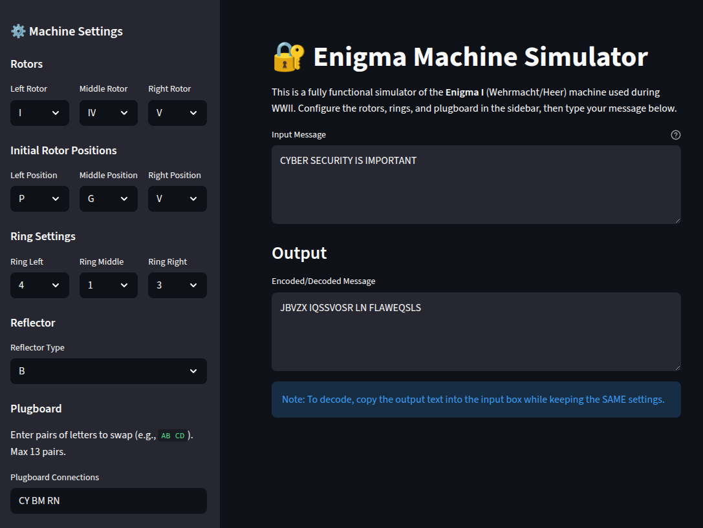

# 🔐 Enigma Machine Simulator

A Python-based Enigma Machine simulator with a Streamlit web interface. This application mimics the behavior of the historical Enigma I (Wehrmacht/Heer) machine used during World War II.

## 📸 Screenshots



## ✨ Features

- **Full Enigma I Simulation**:
  - Support for Rotors I, II, III, IV, and V.
  - Reflectors UKW-B and UKW-C.
  - Configurable Ring Settings (Ringstellung).
  - Configurable Initial Rotor Positions (Grundstellung).
  - Plugboard (Steckerbrett) for letter swapping.
- **Accurate Stepping Mechanism**: Implements the double-stepping anomaly of the middle rotor.
- **Web Interface**: Clean and easy-to-use interface built with Streamlit.
- **Batch Processing**: Encode or decode full sentences at once.

## ⚙️ Installation

1.  **Clone the repository** (or navigate to the directory).
2.  **Create the Conda environment**:
    ```bash
    conda env create -f conda-enigma-env.yml
    ```
3.  **Activate the environment**:
    ```bash
    conda activate enigma-env
    ```

## 🚀 Usage

1.  **Run the application**:
    ```bash
    streamlit run main.py
    ```
2.  **Open your browser**: The app usually runs at `http://localhost:8501`.
3.  **Configure the Machine**:
    - Use the sidebar to select rotors, set ring settings, and initial positions.
    - Set up the plugboard if needed (e.g., `AB CD` to swap A/B and C/D).
4.  **Encode/Decode**:
    - Type your message in the "Input Message" box.
    - The encoded/decoded text will appear in the "Output" box.
    - *Note*: Enigma is reciprocal. To decode, reset the machine to the **same settings** used for encoding and enter the ciphertext.

## 📂 Project Structure

- `main.py`: Entry point for the Streamlit application.
- `enigma.py`: Core logic for the Enigma Machine (Rotors, Plugboard, Reflector).
- `ENIGMA_EXPLAINED.md`: Detailed explanation of the Enigma Machine's inner workings.
- `conda-enigma-env.yml`: Environment dependencies file.
- `screenshots/`: Directory containing application screenshots.
- `LICENSE`: Project license file.
- `README.md`: This file.
